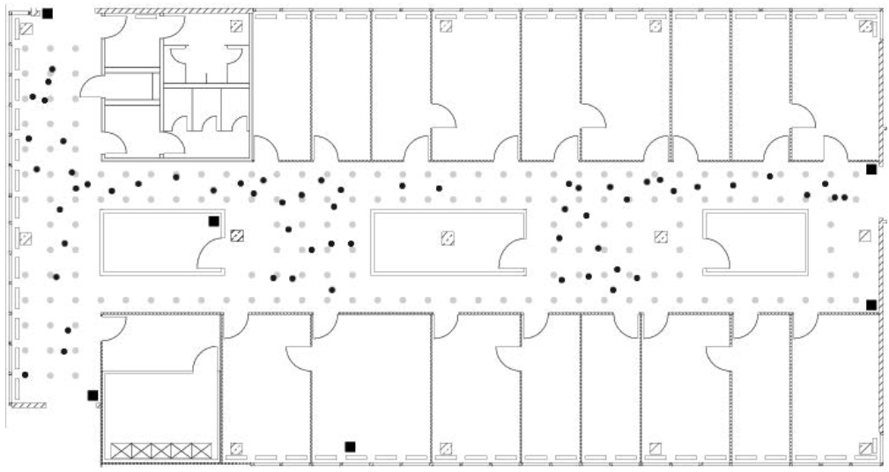

# The Raw Data {#rawdata}

Two relevant data sets for developing an IPS are available on the [CRAWDAD site](https://crawdad.org/mannheim/compass/20080411/) (A Community Resource for Archiving Wireless Data At Dartmouth)[@mannheim-compass-20080411]. One is a reference set, termed "offline," that contains signal strengths measured using a hand-held device on a grid of 166 points spaced 1 meter apart in the hallways of one floor of a building at the University of Mannheim. The floor plan, which measures about 15 meters by 36 meters, is displayed in Figure \@ref(fig:floorplan). The grey circles on the plan mark the locations where the offline measurements were taken and the black squares mark 6 access points. These reference locations give us a calibration set of signal strengths for the building, and we use them to build our model to predict the locations of the hand-held device when its position is unknown.

```{r floorplan, echo=F, fig.cap='Floor plan of the test environment. In this floor plan, the 6 fixed access points are denoted by black square markers, the offline/training data were collected at the locations marked by grey dots, and the online measurements were recorded at randomly selected points indicated with black dots. The grey dots are spaced one meter apart.'}

```


In addition to the $(x,y)$ coordinates of the hand-held device, the orientation of the device was also provided. Signal strengths were recorded at 8 orientations in 45 degree increments (i.e., 0, 45, 90, and so on). Further, the documentation for the data indicates that 110 signal strength measurements were recorded to each of the 6 access points for every location-orientation combination.

`r tufte::newthought('In addition to the offline data,')` a second set of recordings, called the "online" data, is available for testing models for predicting location. In these data, 60 locations and orientations are chosen at random and 110 signals are measured from them to each access point. The test locations are marked by black dots in Figure \@ref(fig:floorplan). In both the offline and online data some of these 110 signal strength values were not recorded. Additionally, measurements from other hand-held devices, e.g., phone or laptop, in the vicinity of the experimental unit appear in some offline records.

The documentation for the data [@mannheim-compass-20080411] describes the format of the data file. Additionally, we can examine the files ourselves with a plain text editor, and we find that each of the two files (offline and online) have the same basic format and start with something similar to

```{r, echo=F, comment=NA}
cat(readLines('offline.final.trace.txt', n = 4), sep = '\n')
```

The available documentation indicates that the format of the data is:

```
t="Timestamp";
id="MACofScanDevice";
pos="RealPosition";
degree="orientation";
MACofResponse1="SignalStrengthValue,Frequency,Mode"; ...
MACofResponseN="SignalStrengthValue,Frequency,Mode"
```

where the units of measurement are shown in Table \@ref(tab:units). The MAC (media access control) variable refers to the MAC address of a hardware device, which is a unique identifier that allows a network card for a computer, access point, or other piece of equipment to be identified on a network. By convention, this identifier is written in the form `mm:mm:mm:ss:ss:ss` where `mm` and `ss` are 2 hexadecimal digits (0, 1, ..., 9, a, b, c, d, e, f). The first of these 3 sets of pairs of digits, i.e., `mm:mm:mm`, identifies the manufacturer of the equipment. The second set of 3 pairs (the `ss`) identifies the particular piece of equipment, both the model and the unique device.
The `MACofResponse1 ... MACofResponseN` in these data indicate that one line consists of a variable number of MAC address measurements. That is, these records are not of equal length, but form ragged arrays that depend on the number of signals detected. For example, consider another line (the 2,000th) in the input file:

```{r, echo=F, comment=NA}
cat(readLines('offline.final.trace.txt', n = 2000)[2000], sep = '\n')
```

We notice several things: this record has 8 readings; the MAC addresses appear in a different order than in the first record; there are 2 readings from the same access point (the 8a access point); and one of the 8 addresses belongs to an `adhoc` device because, according to Table \@ref(tab:units), the mode digit indicates whether the recording is for an `adhoc` device (1) or access point (3). If we look at the first observation again, we notice that there are more than 6 MAC addresses with a mode of 3. The "extras" are from other floors in the building.

```{r units, echo=F}
knitr::kable(
  data_frame(Variable = c('t', 'id', 'pos', 'degree', 'MAC'),
             Units = c('timestamp in milliseconds since midnight, January 1, 1970 UTC', 'MAC address of the scanning device', 'the physical coordinate of the scanning device', 'orientation of the user carrying the scanning device in degrees', 'MAC address of a responding peer (e.g., an access point or a device in adhoc mode) with the corresponding values for signal strength in dBm (Decibel-milliwatts), the channel frequency and its mode (access point = 3, device in adhoc mode = 1)')),
caption = 'Units of Measurement. This table provides the units of measurement for the variables in the offline and online data.',
booktabs = TRUE
)
```

Now that we have a sense of the format of the input file, we can determine how to read the data into a structure that is conducive to analysis. Let’s think about how we want to ultimately represent the resulting data in R. There are two reasonably obvious choices. The first is to have a row in a data frame for each row in the input file. In this case, the variables are time, mac-id, $x$, $y$, $z$ (for the hand-held device’s location), orientation, and then 4 variables for each of the MAC addresses for which we have a signal. These 4 variables are signal, channel, and type of device, as well as the MAC address. Since the raw observations have a different number of recorded signals, our data frame needs enough columns to accommodate the largest number of recordings.

A second approach is to have the same initial variables describing the hand-held device, i.e., time, MAC address, location, and orientation. After this, we have just 4 other variables: the MAC address of the device from which we received a signal, the signal, the channel, and the type of device. In this scenario, we have a row in our data frame for each signal received. That is, each line in the input file turns into multiple rows in the data frame, corresponding to the number of ';'-separated MAC addresses in that line. For example, the first record in the input file becomes 11 rows and the 2000th observation becomes 8 rows in the data frame.

The first approach yields a natural representation that more directly corresponds to the format of the input file. It also avoids repeating the time and location information and so seems more memory efficient. One of the difficulties it presents, however, is that we have to determine how many columns we need, or more specifically, how many MAC addresses received the signal from the device. Even if we drop the `adhoc` readings, we still have to contend with a different ordering of recordings and multiple measurements from the same MAC address. We most likely need two passes of the data to create our data frame: one to determine the unique MAC addresses and the second to organize the data. While we avoid repeating some information, e.g., timestamp, we need to use `NA` values for the observations that do not have recorded signals from all of the MAC addresses. If there are many of these, then the second approach may actually be more memory efficient. The second approach also appears simpler to create.

With the second approach, we can avoid two passes of the data and read the file into a data frame in just one pass. And, this data structure allows us to use group-by operations on the MAC addresses. For now, we adopt the second approach. Later in our work, we create a data frame with the first format. For this, we do not need to return to the original file, but create the alternative data frame from the existing one.

Another consideration in determining how to read the data into R is whether or not the "comment" lines occur only at the beginning/top of the file. We can search in the file for lines that start with a '#' character. To do this, we read the entire document into R using `readLines()` with

```{r}
txt <- readLines('offline.final.trace.txt')
```

Each line in the offline file has been read into R as a string in the character vector `txt`. We use the `stringr::str_detect()` function to locate lines/strings that begin with a '#' character and tally them with

```{r}
sum(str_detect(txt, '^#'))
```

Additionally, we use `length()` as follows:

```{r}
length(txt)
```

to determine that there are 151,392 lines in the offline file. According to the documentation we expect there to be 146,080 lines in the file (166 locations × 8 angles × 110 recordings). The difference between these two (151,392 and 146,080) is 5,312, exactly the number of comments lines.

Generally a good rule of thumb to follow is to check our assumptions about the format of a file and not just look at the first few lines.

## Processing the Raw Data

Now that we have determined the desired target representation of the data in R, we can write the code to extract the data from the input file and manipulate it into that form. The data are not in a rectangular form so we cannot simply use a function such as `read.table()`. However, there is structure in the observations that we can use to process the lines of text. For example, the main data elements are separated by semicolons. Let’s see how the semicolon splits the fourth line, i.e., the first line that is not a comment:

```{r}
str_split(txt[4], ';', simplify = TRUE) %>% drop()
```

Within each of these shorter strings, the “name” of the variable is separated by an ‘=’ character from the associated value. In some cases this value contains multiple values where the separator is a ‘,’. For example, "pos=0.0,0.0,0.0" consists of 3 position variables that are not named.
We can take this vector, which we created by splitting on the semi-colon, and further split each element at the ‘=’ characters. Then we can process the resulting strings by splitting them at the ‘,’ characters. We can use

```
tokens <- stringr::str_split(txt[4], '[;=,]')
```

to split at a ';', '=', or ',' character. The following function takes one line and creates a data frame of all of the signals from that particular device.

```{r}
process_line <- function(x) {
  tokens <- str_split(x, '[;=,]', simplify = TRUE) %>% drop()
  if (length(tokens) <= 10) return(NULL)
  mac_signals <- matrix(tokens[-(1:10)],
                        ncol = 4,
                        byrow = TRUE)
  device_info <- matrix(tokens[c(2, 4, 6:8, 10)],
                        nrow = nrow(mac_signals),
                        ncol = 6,
                        byrow = TRUE)
  df <- as_data_frame(cbind(device_info, mac_signals))
  names(df) <- c('time', 'scan_mac', 'posX', 'posY', 'posZ',
                 'orientation', 'mac', 'signal', 'channel', 'type')
  df
}
```

Next we'll use `purrr::map_dfr()` to apply this function to every line of the input file and concatenate the results row-wise into a data frame. To make sure everything is working, let's try it on the first few lines.

```{r}
tmp <- map_dfr(txt[4:20], process_line)
dim(tmp)
```

Now we can try it on the entire dataset. We discard the lines starting with the comment character ‘#’ and then pass each remaining line to `process_line()`.

```{r}
lines <- txt[!str_detect(txt, '^#')]
offline <- map_dfr(lines, process_line)
dim(offline)
```

Our data frame consists of character-valued variables. A next step is to convert these values into appropriate data types, e.g., convert signal strength to numeric, and to further clean the data as needed. This is the topic of the next chapter.