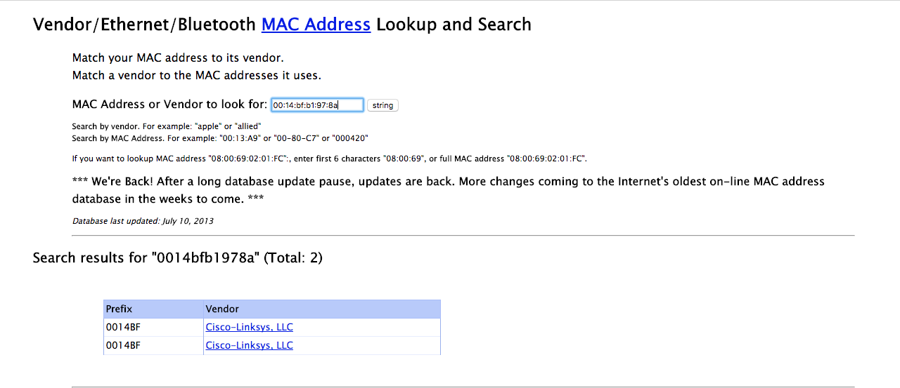

# Cleaning the Data and Building a Representation for Analysis {#cleandata}

We convert the position, signal, and time variables to numeric with

```{r}
num_vars <- c('time', 'posX', 'posY', 'posZ', 'orientation', 'signal')
offline <- offline %>% mutate_at(num_vars, as.numeric)
```

In our analysis, we plan to use only the signal strengths measured to the fixed access points to develop and test our model, so we will drop all records for `adhoc` measurements and remove the `type` variable from our data frame.

```{r}
offline <- offline %>% 
  filter(type == 3) %>% 
  select(-type)
dim(offline)
```

We have removed about 200,000 records from our data frame.

Next we consider the time variable. According to the documentation, time is measured in the number of milliseconds from midnight on January 1st, 1970. This is the origin used for the `POSIXt` format, but with `POSIXt`, it is the number of seconds, not milliseconds. We can scale the value of time to seconds and then simply set the class of the `time` element in order to have the values appear and operate as date-times in R. We keep the more precise time in `rawtime` just in case we need it. We perform the conversion as follows:

```{r}
offline <- offline %>% 
  mutate(rawtime = time,
         time = lubridate::as_datetime(time / 1000))
```

Now that we have completed these conversions, we check the types of the variables in the data frame with

```{r}
unlist(sapply(offline, class))
```

We have the correct shape for the data and even the correct types. We next verify that the actual values of the data look reasonable. There are many approaches we can take to do this. We start by looking at a summary of each numeric variable with

```{r}
offline %>% select(num_vars) %>% summary()
```

We also convert the character variables to factors and examine them with

```{r}
offline %>%
  select(mac, channel, scan_mac) %>%
  mutate_all(as_factor) %>% 
  summary()
```

After examining these summaries, we find a couple of anomalies:

* There is only one value for `scan_mac`, the MAC address for the hand-held device from which the measurements were taken. We might as well discard this variable from our data frame. However, we may want to note this value to compare it with the online data.
* All of the values for `posZ`, the elevation of the hand-held device, are 0. This is because all of the measurements were taken on one floor of the building. We can eliminate this variable also.

We modify our data frame accordingly,

```{r}
offline <- offline %>% select(-posZ, -scan_mac)
```

## Exploring Orientation

According to the documentation, we should have only 8 values for orientation, i.e., 0, 45, 90, ..., 315. We can check this with

```{r}
length(unique(offline$orientation))
```

Clearly, this is not the case. Let’s examine the distribution of orientation:

```{r ecdf, fig.cap="Empirical CDF of Orientation for the Hand-Held Device. This empirical distribution function of orientation shows that there are 8 basic orientations that are 45 degrees apart. We see from the steps in the function that these orientations are not exactly 45, 90, 135, etc. Also, the 0 orientation is split into the two groups, one near 0 and the other near 360."}
e <- ecdf(offline$orientation)
data_frame(orientation = offline$orientation,
           CDF = e(orientation)) %>% 
  ggplot(aes(orientation, CDF)) +
  geom_point(size = 0.4) +
  geom_line() +
  geom_hline(yintercept = 0:1, color = 'grey', linetype = 'dashed') +
  scale_x_continuous(breaks = seq(0, 360, by = 45))
```

An annotated version of this plot appears in Figure \@ref(fig:ecdf). It shows the orientation values are distributed in clusters around the expected angles. Note the values near 0 and near 360 refer to the same direction. That is, an orientation value 1 degree before 0 is reported as 359 and 1 degree past 0 is a 1.

Although the experiment was designed to measure signal strength at 8 orientations – 45 degree intervals from 0 to 315 – these orientations are not exact. However, it may be useful in our analysis to work with values corresponding to the 8 equi-spaced angles. That is, we want to map 47.5 to 45, and 358.2 to 0, and so on. To do this, we take each value and find out to which of the 8 orientations it is closest and we return that orientation. We must handle values such as 358.2 carefully as we want to map them to 0, not to the closer 315. The following makes this conversion:

```{r}
round_orientation = function(angles) {
  refs = seq(0, by = 45, length  = 9)
  q = sapply(angles, function(o) which.min(abs(o - refs)))
  c(refs[1:8], 0)[q]
}
```


```{r}
offline <- offline %>% 
  mutate(angle = cut(offline$orientation,
                     breaks = seq(0, 405, by = 45) - 45/2,
                     labels = seq(0, 360, by = 45))) %>% 
  mutate(angle = factor(c(seq(0, 315, by = 45), 0)[as.numeric(angle)]))
```

We check that the results are as we expect with boxplots:

```{r orientation, fig.cap="Boxplots of Orientation for the Hand-Held Device. These boxplots of the original orientation against the rounded value confirm that the values have mapped correctly to 0, 45, 90, 135, etc. The “outliers” at the top left corner of the plot are the values near 360 that have been mapped to 0."}
ggplot(offline, aes(angle, orientation)) +
  geom_boxplot()
```

From Figure \@ref(fig:orientation) we see that the new values look correct and the original values near 360 degrees are mapped to 0. It also shows the variability in the act of measuring.

## Exploring MAC Addresses

From the `summary()` information, it seems that there may be a one-to-one mapping between the MAC address of the access points and channel. For example, the summary statistics show there are 126,529 occurrences of the address `00:14:bf:3b:c7:c6` and the same number of occurrences of channel `2432000000`. To help us ascertain if we do have a one-to-one mapping, we look at the relationship between the MAC address and channel.

How many unique addresses and channels do we have? There should be the same number, if there is a one-to-one mapping. We find:

```{r}
c(length(unique(offline$mac)), length(unique(offline$channel)))
```

There are 12 MAC addresses and 8 channels. We were given the impression from the building plan (see Figure \@ref(fig:floorplan)) that there are only 6 access points. Why are there 8 channels and 12 MAC addresses? Rereading the documentation we find that there are additional access points that are not part of the testing area and so not seen on the floor plan. Let’s check the counts of observations for the various MAC addresses with `table()`:

```{r}
table(offline$mac)
```

Clearly the first and the last two MAC addresses are not near the testing area or were only working/active for a short time during the measurement process because their counts are very low. It’s probably also the case that the third and fifth addresses are not among the access points displayed on the map because they have much lower counts than the others and these are far lower than the possible 146,080 recordings (recall that there are potentially signals recorded at 166 grid points, 8 orientations, and 110 replications).

```{r coffer, echo=F, fig.cap="Screenshot of the coffer.com Mac Address Lookup Form. The coffer.com website offers lookup services to find the MAC address for a vendor and vice versa."}

```

According to the documentation, the access points consist of 5 Linksys/Cisco and one Lancom L-54g routers. We look up these MAC addresses at the [http://coffer.com/mac_find/]() site to find the vendor addresses that begin with `00:14:bf` belong to Linksys devices, those beginning with `00:0f:a3` belong to Alpha Networks, and Lancom devices start with `00:a0:57` (see Figure \@ref(fig:coffer)). We do have 5 devices with an address that begins `00:14:bf`, which matches with the Linksys count from the documentation. However, none of our MAC addresses begin with `00:a0:57` so there is a discrepancy with the documentation. Nonetheless, we have discovered valuable information for piecing together a better understanding of the data. For now, let’s keep the records from the top 7 devices. We do this with

```{r}
top_macs <- offline %>% 
  count(mac) %>% 
  top_n(7, n) %>% 
  arrange(desc(n)) %>% 
  .$mac
offline <- offline %>% filter(mac %in% top_macs)
```

Finally, we create a table of counts for the remaining MAC×channel combinations and confirm there is one non-zero entry in each row.

```{r}
mac_channel <- table(offline$mac, offline$channel)
apply(mac_channel, 1, function(x) sum(x > 0))
```

Indeed we see that there is a one-to-one correspondence between MAC address and channel for these 7 devices. This means we can eliminate `channel` from `offline`, i.e.,

```{r}
offline <- offline %>% select(-channel)
```

## Exploring the Position of the Hand-Held Device

Lastly, we consider the position variables, `posX` and `posY`. For how many different locations do we have data? 

```{r}
loc_counts <- offline %>% 
  group_by(posX, posY) %>% 
  tally()
```

We have 166 different locations with roughly 5,500 recordings at each position. This is in accord with 8 orientations × 110 replications × 7 access points, which is 6,160 signal strength measurements.

We can visualize all 166 counts by adding tiles at each location and coloring them according to the counts. We see in Figure \@ref(fig:loc-counts) that there are roughly the same number of signals detected at each location.

```{r loc-counts, fig.cap="Counts of signals detected at each position. Plotted at each location in the building is the total number of signals detected from all access points for the offline data. Ideally for each location, 110 signals were measured at 8 angles for each of 6 access points, for a total of 5280 recordings. These data include a seventh Mac address and not all signals were detected, so there are about 5500 recordings at each location."}
ggplot(loc_counts, aes(posX, posY, fill = n)) +
  geom_tile() +
  scale_fill_distiller(palette = 'Reds')
```

## Creating a Function to Prepare the Data

We have examined all the variables except `time` and `signal`. This process has helped us clean our data and reduce it to those records that are relevant to our analysis. We leave the examination of the signals to the next section where we study its distributional properties. As for `time`, while this variable is not directly related to our model, it indicates the order in which the observations were taken. In an experiment, this can be helpful in uncovering potential sources of bias. For example, the person carrying the hand-held device may have changed how the device was carried as the experiment progressed and this change may lead to a change in the strength of the signal. Plots and analyses of the relationship between time and other variables can help us uncover such potential problems. We leave this investigation as an exercise.

Since we also want to read the online data in R, we turn all of these commands into a function called `read_data()`. Additionally, if we later change our mind as to how we want to handle some of these special cases, e.g., to keep `channel` or `posZ`, then we can make a simple update to our function and rerun it. We might even add a parameter to the function definition to allow us to process the data in different ways. We leave it as an exercise to create `read_data()`.

```{r}
read_data <- function(file, subMacs) {
  txt <- readLines(file)
  lines <- txt[!str_detect(txt, '^#')]
  rawdata <- map_dfr(lines, process_line)
  # clean the raw data
  num_vars <- c('time', 'posX', 'posY', 'posZ', 'orientation', 'signal')
  rawdata <- rawdata %>%
    mutate_at(num_vars, as.numeric) %>% 
    filter(type == '3') %>% 
    select(-type) %>% 
    mutate(rawtime = time,
           time = lubridate::as_datetime(time / 1000)) %>% 
    select(-posZ, -scan_mac) 
  rawdata <- rawdata %>% 
    mutate(angle = cut(rawdata$orientation,
                       breaks = seq(0, 405, by = 45) - 45/2,
                       labels = seq(0, 360, by = 45))) %>% 
    mutate(angle = factor(c(seq(0, 315, by = 45), 0)[as.numeric(angle)])) %>% 
    filter(mac %in% subMacs) %>% 
    select(-channel)
}
```

We call `read_data()` to create the offline data frame with

```{r}
offline_redo <- read_data('offline.final.trace.txt', subMacs = unique(offline$mac))
```

Then we use the `identical()` function to check this version of the data frame against the one that we already created:

```{r}
identical(offline, offline_redo)
```

This confirms that our function behaves as expected.